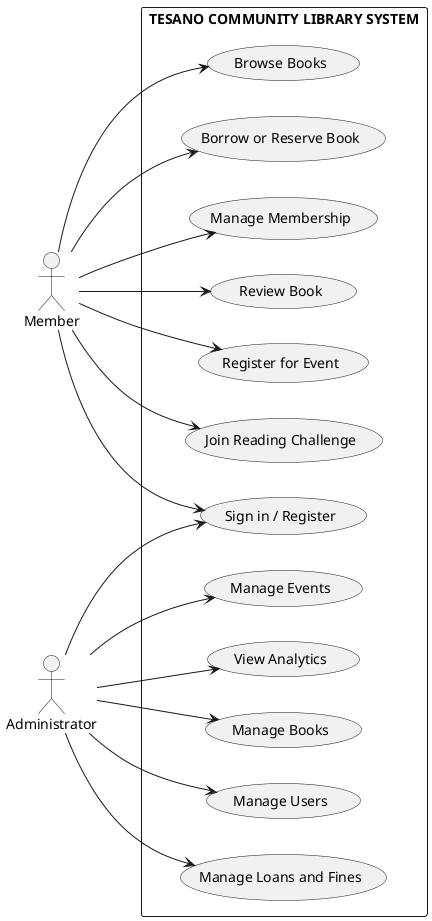
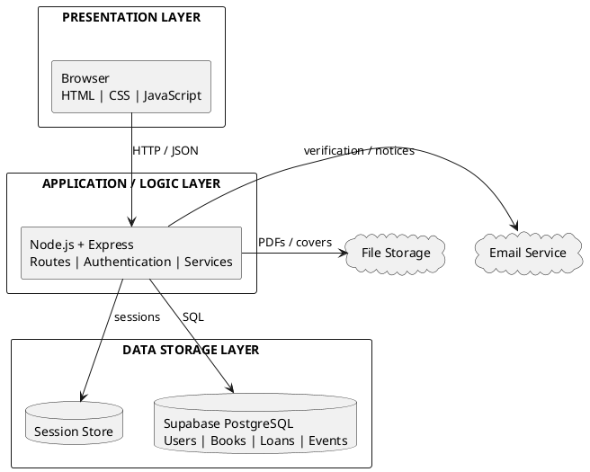
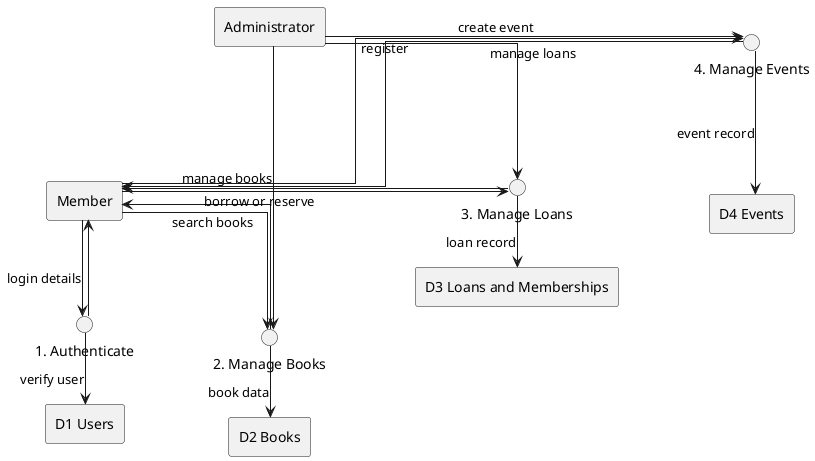
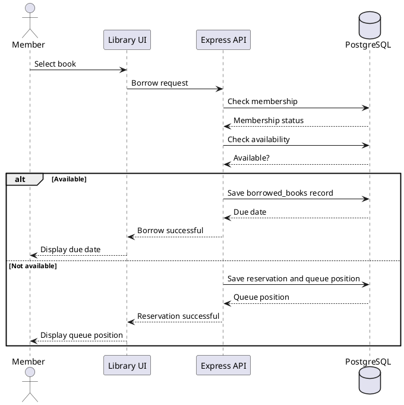
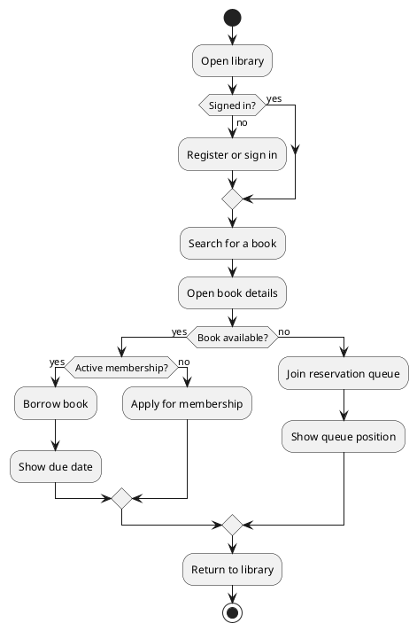
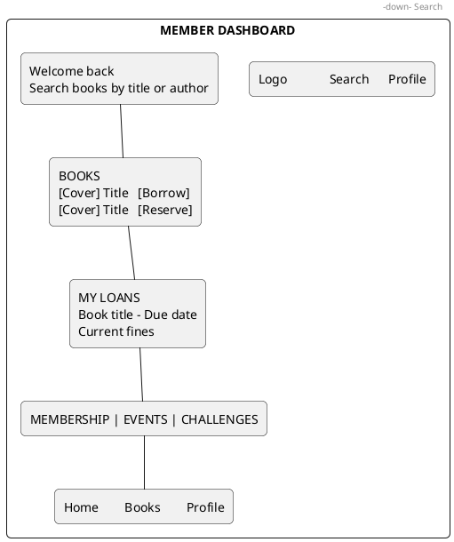
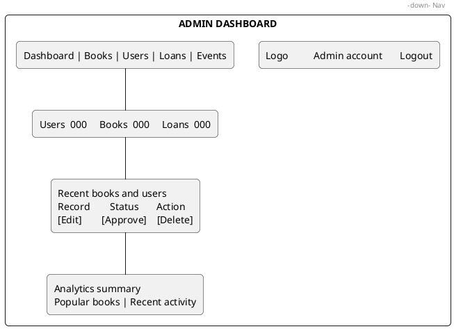

# Tesano Community Library Diagrams

These simplified diagrams use the formal notation from the accepted sample while showing only the main parts of this library system.

## Diagram Symbol Conventions

The diagrams use these standard conventions:

| Diagram | Symbol | Meaning |
|---|---|---|
| Use case | Stick figure | Actor outside the system |
| Use case | Oval | User goal or system function |
| Use case | System boundary rectangle | Scope of the application |
| Architecture | Layered rectangle | Presentation, application, or data layer |
| Architecture | Database cylinder | Persistent database or session store |
| Data flow | Rectangle | External entity or data store |
| Data flow | Circle | Process that transforms data |
| Data flow | Arrow | Named data movement |
| Sequence | Lifeline and arrow | Participant interaction over time |
| Activity | Rounded action box | Activity or task |
| Activity | Diamond | Decision or condition |
| Activity | Filled start/stop circle | Beginning or end of a flow |
| ERD (Chen) | Rectangle | Entity |
| ERD (Chen) | Diamond | Relationship between entities |
| ERD (Chen) | Oval | Entity attribute |
| ERD (Chen) | Underlined attribute | Primary key |
| Wireframe | Rectangle viewport | Screen boundary and interface region |

The ERD intentionally uses Chen notation, matching the accepted sample. The DFD uses a simple Yourdon-style presentation: external entities and data stores are rectangles, processes are circles, and every meaningful connection is a labeled arrow.

## 1. Use Case Diagram



## 2. System Architecture Diagram



## 3. Data-Flow Diagram



## 4. Sequence Diagram: Borrow a Book



## 5. Activity Diagram: Member Borrowing Journey



## 6. Entity-Relationship Diagram

This conceptual ERD focuses on the entities used by the main borrowing workflow. It uses Chen notation rather than database-table boxes: entities are rectangles, relationships are diamonds, and attributes are ovals. Other tables such as events, challenges, and badges support additional modules and are omitted to keep the figure readable.

```plantuml
@startuml
skinparam shadowing false
skinparam linetype ortho
skinparam nodesep 45
skinparam ranksep 55

' Chen notation: rectangles = entities, diamonds = relationships, ovals = attributes.

rectangle "USER" as User
rectangle "BOOK" as Book
rectangle "MEMBERSHIP" as Membership
rectangle "BORROWED BOOK" as Borrowed
rectangle "RESERVATION" as Reservation
rectangle "FINE" as Fine

diamond "has" as HasMembership
diamond "borrows" as Borrows
diamond "reserves" as Reserves
diamond "creates" as CreatesFine

usecase "<u>userId</u>" as UserId
usecase "username" as Username
usecase "email" as Email
usecase "role" as Role

usecase "<u>bookId</u>" as BookId
usecase "title" as Title
usecase "author" as Author

usecase "<u>membershipId</u>" as MembershipId
usecase "status" as MembershipStatus

usecase "<u>borrowId</u>" as BorrowId
usecase "dueDate" as DueDate
usecase "returnDate" as ReturnDate

usecase "<u>reservationId</u>" as ReservationId
usecase "queuePosition" as QueuePosition

usecase "<u>fineId</u>" as FineId
usecase "amount" as Amount

User - HasMembership : 1
HasMembership - Membership : N
User - Borrows : 1
Borrows - Borrowed : N
Book - Borrows : 1
Borrows - Book : N
User - Reserves : 1
Reserves - Reservation : N
Book - Reserves : 1
Reserves - Book : N
Borrowed - CreatesFine : 1
CreatesFine - Fine : N

User - UserId
User - Username
User - Email
User - Role
Book - BookId
Book - Title
Book - Author
Membership - MembershipId
Membership - MembershipStatus
Borrowed - BorrowId
Borrowed - DueDate
Borrowed - ReturnDate
Reservation - ReservationId
Reservation - QueuePosition
Fine - FineId
Fine - Amount

legend right
  |= Shape |= Chen meaning |
  | rectangle | Entity |
  | diamond | Relationship |
  | oval | Attribute |
  | underlined text | Primary key |
endlegend
@enduml
```

## 7. UI Wireframes

### Member Dashboard



### Admin Dashboard



Suggested report captions: `Figure 3.1 Use Case Diagram`, `Figure 3.2 System Architecture`, `Figure 3.3 Data-Flow Diagram`, `Figure 3.4 Sequence Diagram`, `Figure 3.5 Activity Diagram`, `Figure 3.6 Entity-Relationship Diagram`, and `Figure 4.1 UI Wireframes`.

## Notation References

- [Lucidchart: Entity-relationship diagrams](https://www.lucidchart.com/pages/er-diagrams) describes Chen notation as rectangles for entities, diamonds for relationships, ovals for attributes, and cardinality on relationships.
- [Lucidchart: Data-flow diagrams](https://www.lucidchart.com/pages/data-flow-diagram) identifies external entities, processes, data stores, and labeled data-flow arrows as the four core DFD components.
- [Visual Paradigm: What is a Data Flow Diagram?](https://www.visual-paradigm.com/guide/data-flow-diagram/what-is-data-flow-diagram/) documents DFD process, data-flow, data-store, external-entity, numbering, and no-cross-line conventions.
- [Visual Paradigm: UML diagram tools](https://www.visual-paradigm.com/features/uml-tool/) identifies use-case, sequence, and activity diagrams as UML diagram types.
