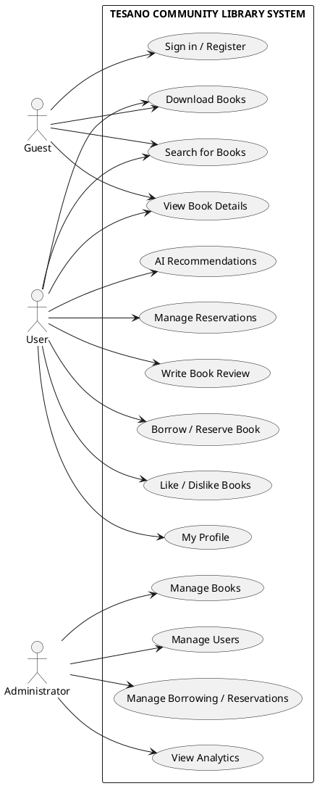
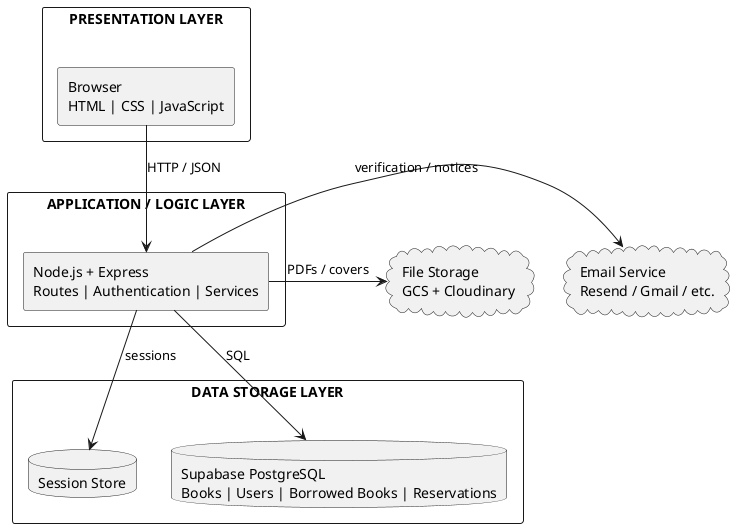
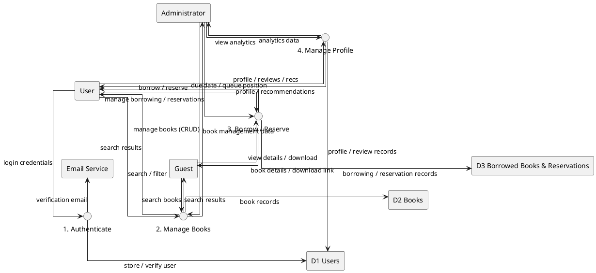
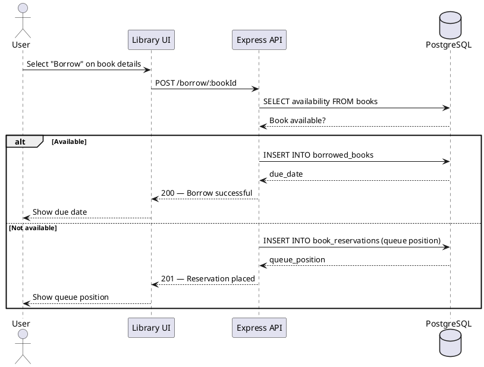
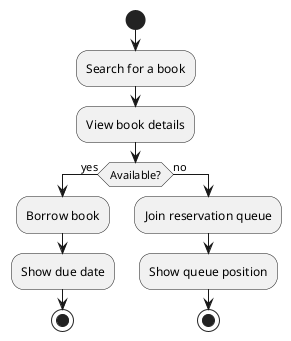
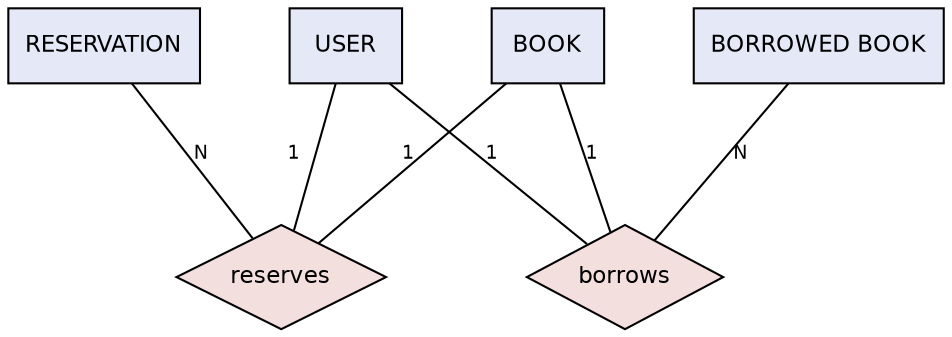

# Tesano Community Library — System Diagrams

These diagrams reflect the actual functionality of the application as implemented in the source code (`src/routes/`, `src/app.js`, `public/`).

## Diagram Symbol Conventions

The diagrams use these standard conventions, drawn from accepted UML and data-modelling notation:

| Diagram | Symbol | Meaning |
|---|---|---|
| Use case | Stick figure | Actor outside the system |
| Use case | Oval | User goal or system function |
| Use case | System boundary rectangle | Scope of the application |
| Architecture | Layered rectangle | Presentation, application, or data layer |
| Architecture | Database cylinder | Persistent database or session store |
| Data flow | Rectangle | External entity or data store |
| Data flow | Circle | Process that transforms data |
| Data flow | Arrow | Named data movement |
| Sequence | Lifeline and arrow | Participant interaction over time |
| Sequence | Solid arrow | Synchronous call |
| Sequence | Dashed arrow | Return message |
| Sequence | `alt` frame | Alternative flow (branch) |
| Activity | Rounded action box | Activity or task |
| Activity | Diamond | Decision or condition |
| Activity | Filled circle / stop circle | Beginning or end of a flow |
| ERD (Chen) | Rectangle | Entity |
| ERD (Chen) | Diamond | Relationship between entities |
| ERD (Chen) | Labels on edges | Cardinality (1, N, 0:N, etc.) |

---

## 1. Use Case Diagram

Three actors with distinct levels of access. Guest performs public, unauthenticated actions. User adds authenticated interactions. Admin manages the system.

```plantuml
@startuml
left to right direction
skinparam shadowing false
skinparam packageStyle rectangle

actor Guest
actor User
actor Administrator as Admin

rectangle "TESANO COMMUNITY LIBRARY SYSTEM" {
  usecase "Sign in / Register" as Login
  usecase "Search for Books" as Search
  usecase "View Book Details" as Details
  usecase "Download Books" as Download
  usecase "Write Book Review" as Review
  usecase "Borrow / Reserve Book" as Borrow
  usecase "Like / Dislike Books" as Like
  usecase "My Profile" as Profile
  usecase "AI Recommendations" as Rec
  usecase "Manage Reservations" as Reservations
  usecase "Manage Books" as Books
  usecase "Manage Users" as Users
  usecase "Manage Borrowing / Reservations" as BorrowManage
  usecase "View Analytics" as Analytics
}

Guest --> Login
Guest --> Search
Guest --> Details
Guest --> Download

User --> Search
User --> Details
User --> Download
User --> Review
User --> Borrow
User --> Like
User --> Profile
User --> Rec
User --> Reservations

Admin --> Books
Admin --> Users
Admin --> BorrowManage
Admin --> Analytics
@enduml
```

---

## 2. System Architecture Diagram

Three horizontal layers with external cloud services. The Presentation layer runs in the browser, the Application layer is the Node.js/Express API, and the Data layer persists everything in Supabase PostgreSQL.

```plantuml
@startuml
skinparam shadowing false
skinparam componentStyle rectangle

rectangle "PRESENTATION LAYER" {
  rectangle "Browser\nHTML | CSS | JavaScript" as UI
}

rectangle "APPLICATION / LOGIC LAYER" {
  rectangle "Node.js + Express\nRoutes | Authentication | Services" as API
}

rectangle "DATA STORAGE LAYER" {
  database "Supabase PostgreSQL\nBooks | Users | Borrowed Books | Reservations" as DB
  database "Session Store" as Session
}

cloud "File Storage\nGCS + Cloudinary" as Storage
cloud "Email Service\nResend / Gmail / etc." as Email

UI -down-> API : HTTP / JSON
API -down-> DB : SQL
API -right-> Session : sessions
API -right-> Storage : PDFs / covers
API -right-> Email : verification / notices
@enduml
```

---

## 3. Data-Flow Diagram (DFD Level 1)

Four processes transform data between external actors and three data stores. Guest accesses public functions, User accesses authenticated functions, and Administrator manages books, borrowing, and analytics.

```plantuml
@startuml
left to right direction
skinparam shadowing false
skinparam linetype ortho
skinparam nodesep 70
skinparam ranksep 90

' External entities (rectangles)
rectangle "Guest" as Guest
rectangle "User" as User
rectangle "Administrator" as Admin
rectangle "Email Service" as Email

' Processes (circles, numbered)
circle "1. Authenticate" as P1
circle "2. Manage Books" as P2
circle "3. Borrow / Reserve" as P3
circle "4. Manage Profile" as P4

' Data stores (rectangles)
rectangle "D1 Users" as D1
rectangle "D2 Books" as D2
rectangle "D3 Borrowed Books & Reservations" as D3

' Layout helpers
P1 -[hidden]down-> P2
P2 -[hidden]down-> P3
P3 -[hidden]down-> P4

D1 -[hidden]down-> D2
D2 -[hidden]down-> D3

' Data flows from external entities to processes
Guest -right-> P2 : search books
Guest -right-> P3 : view details / download

User -right-> P1 : login credentials
User -right-> P2 : search / filter
User -right-> P3 : borrow / reserve
User -right-> P4 : profile / reviews / recs

Admin -right-> P2 : manage books (CRUD)
Admin -right-> P3 : manage borrowing / reservations
Admin -right-> P4 : view analytics

' Data flows from processes to data stores
P1 -right-> D1 : store / verify user
P2 -right-> D2 : book records
P3 -right-> D3 : borrowing / reservation records
P4 -right-> D1 : profile / review records

' Data flows back to actors
P1 -left-> Email : verification email
P2 -left-> Guest : search results
P2 -left-> User : search results
P3 -left-> Guest : book details / download link
P3 -left-> User : due date / queue position
P4 -left-> User : profile / recommendations
P2 -left-> Admin : book management data
P4 -left-> Admin : analytics data

@enduml
```

---

## 4. Sequence Diagram: Borrow a Book

A User borrows a physical book through the web UI. The API checks availability in the database and either creates a borrow record (if available) or places the user in a reservation queue.

```plantuml
@startuml
actor User
participant "Library UI" as UI
participant "Express API" as API
database PostgreSQL as DB

User -> UI : Select "Borrow" on book details
UI -> API : POST /borrow/:bookId
API -> DB : SELECT availability FROM books
DB --> API : Book available?

alt Available
  API -> DB : INSERT INTO borrowed_books
  DB --> API : due_date
  API --> UI : 200 — Borrow successful
  UI --> User : Show due date
else Not available
  API -> DB : INSERT INTO book_reservations (queue position)
  DB --> API : queue_position
  API --> UI : 201 — Reservation placed
  UI --> User : Show queue position
end
@enduml
```

---

## 5. Activity Diagram: Borrow a Book

The user searches for a book, views its details, and either borrows it directly or joins a reservation queue depending on availability.

```plantuml
@startuml
start
:Search for a book;
:View book details;
if (Available?) then (yes)
  :Borrow book;
  :Show due date;
  stop
else (no)
  :Join reservation queue;
  :Show queue position;
  stop
endif
@enduml
```

---

## 6. Entity-Relationship Diagram (Chen Notation — no attributes)

Four core entities with two relationship diamonds. No attribute ovals and no fine-related entities are shown, keeping the diagram focused on the essential data model.

```dot
graph ERD {
    graph [fontname="Helvetica", nodesep=0.6, ranksep=0.8, splines=line];
    node [fontname="Helvetica", fontsize=11];
    edge [fontname="Helvetica", fontsize=9];

    // Entities (rectangles)
    node [shape=box, style=filled, fillcolor="#e5e8f7"];
    User [label="USER"];
    Book [label="BOOK"];
    Borrowed [label="BORROWED BOOK"];
    Reservation [label="RESERVATION"];

    // Relationships (diamonds)
    node [shape=diamond, style=filled, fillcolor="#f4dfdf", height=0.7];
    Borrows [label="borrows"];
    Reserves [label="reserves"];

    // Entity-to-relationship edges with cardinality labels
    User -- Borrows [label="1"];
    Borrowed -- Borrows [label="N"];
    Book -- Borrows [label="1"];

    User -- Reserves [label="1"];
    Reservation -- Reserves [label="N"];
    Book -- Reserves [label="1"];
}
```

Render with Graphviz: `dot -Tpng erd.dot -o erd.png`

---

## Suggested Captions

`Figure 3.1 Use Case Diagram`, `Figure 3.2 System Architecture Diagram`, `Figure 3.3 Data-Flow Diagram (DFD Level 1)`, `Figure 3.4 Sequence Diagram`, `Figure 3.5 Activity Diagram`, `Figure 3.6 Entity-Relationship Diagram`.

---

## Notation References

- [Lucidchart: Entity-relationship diagrams](https://www.lucidchart.com/pages/er-diagrams) — Chen notation: rectangles for entities, diamonds for relationships, ovals for attributes.
- [Lucidchart: Data-flow diagrams](https://www.lucidchart.com/pages/data-flow-diagram) — DFD core components: external entities, processes, data stores, labeled data-flow arrows.
- [Visual Paradigm: What is a Data Flow Diagram?](https://www.visual-paradigm.com/guide/data-flow-diagram/what-is-data-flow-diagram/) — documents DFD process, data-flow, data-store, external-entity conventions and the no-cross-line rule.
- [Visual Paradigm: UML diagram types](https://www.visual-paradigm.com/features/uml-tool/) — identifies use-case, sequence, and activity diagrams as standard UML diagram types.
